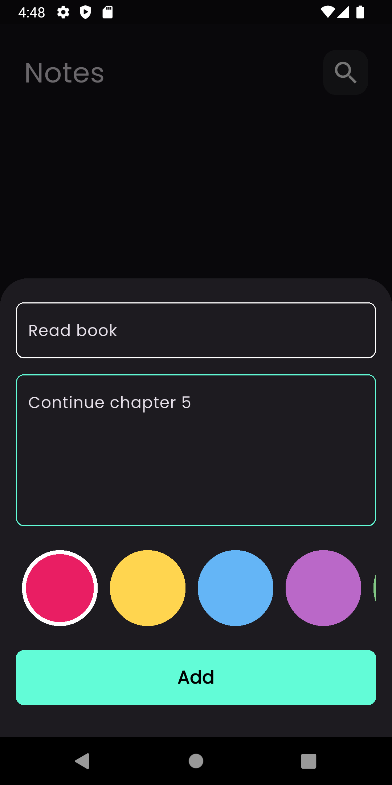
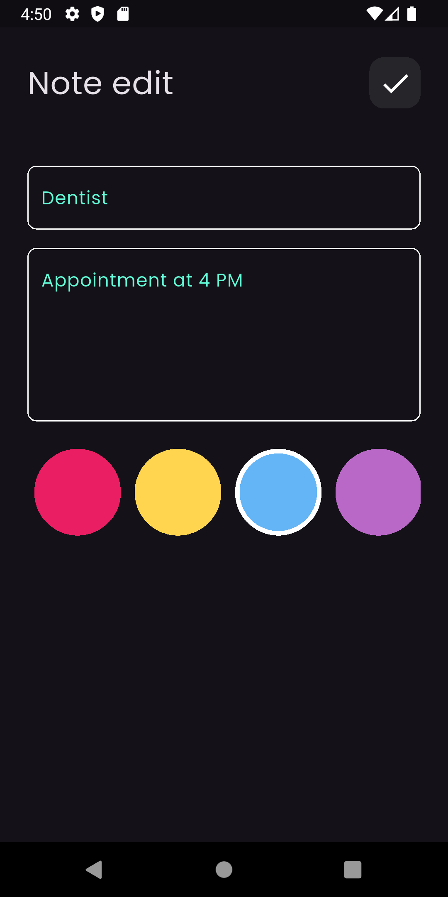

# 📝 Notes App - Flutter  
A simple and elegant **Notes Application** built with **Flutter**, allowing users to easily write, edit, and organize their notes locally. The app stores data directly on the device using **Hive**, supports custom background colors for notes, and enables full editing and deletion functionality. This project was created as part of my **Flutter learning journey**, with a focus on **clean code practices** and using modern state management with **Cubit**.  

---

## 🚀 Features  
- 🖊 **Add Notes**: Create new notes with custom text and background colors  
- 🎨 **Custom Colors**: Choose background colors for your notes  
- ✏ **Edit Notes**: Update note text and colors anytime  
- 🗑 **Delete Notes**: Remove notes easily when no longer needed  
- 💾 **Local Storage**: Data stored locally using **Hive** (no internet required)  
- ⚡ **Fast & Smooth**: Lightweight, responsive UI  
- 🧹 **Clean Code**: Written with maintainability in mind  

---

## 📸 App Screenshots  
<p align="center">  
    
    
    
</p>  

---

## 🛠️ Technologies Used  
- **Flutter** 🐦  
- **Dart**  
- **Cubit** for state management  
- **Hive** for local storage  
- **Flutter Color Picker** for color selection  
- Other helpful Flutter libraries for UI/UX improvements  

---


## 📂 Project Structure  

```
lib/
├── cubits/
│   ├── add_note_cubit/
│   │   ├── add_note_cubit.dart
│   │   └── add_note_state.dart
│   ├── notes_cubit/
│   │   ├── notes_cubit.dart
│   │   └── notes_state.dart
│
├── models/
│   ├── note_model.dart
│   └── note_model.g.dart
│
├── views/
│   ├── edit_note_view.dart
│   └── notes_view.dart
│
├── widgets/
│   ├── add_note_bottom_sheet.dart
│   ├── add_note_form.dart
│   ├── colors_list_view.dart
│   ├── custom_app_bar.dart
│   ├── custom_button.dart
│   ├── custom_icon.dart
│   ├── custom_note_item.dart
│   ├── custom_text_field.dart
│   ├── edit_note_colors_list_view.dart
│   ├── edit_note_view_body.dart
│   ├── notes_list_view.dart
│   └── notes_view_body.dart
│
├── constants.dart
├── main.dart
└── simple_bloc_observer.dart

```

## 📝 How to Use

1. **Clone the repo**:
   ```bash
   git clone https://github.com/sahiralzakaria/Flutter-Learning-Apps-NotesApp.git
   cd Flutter-Learning-Apps-NotesApp

2. **Install dependencies**:
   ```bash
   flutter pub get
   ```

3. **Run the app**:
   ```bash
   flutter run
   ```
---

## 👨‍💻 Author

- [](https://github.com/sahiralzakaria) **GitHub:** [sahiralzakaria](https://github.com/sahiralzakaria)  
- [](https://www.linkedin.com/in/sahir-zakaria-39873531b) **LinkedIn:** [sahir-zakaria](https://www.linkedin.com/in/sahir-zakaria-39873531b)  
- [](mailto:sahir.alzakaria@gmail.com) **Email:** sahir.alzakaria@gmail.com  

---

<div align="center">
  <p>Made with ❤️ by <strong>Sahir Zakaria</strong></p>
  <p><em>Happy Coding! 🚀</em></p>
</div>
